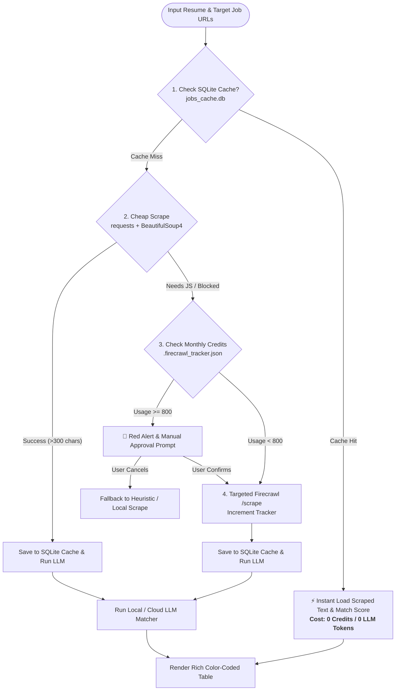

# AI Agent Workspace 🤖

[](https://www.python.org/downloads/)
[](https://modelcontextprotocol.io/)
[](https://firecrawl.dev/)
[](https://antigravity.google)
[](https://opensource.org/licenses/MIT)

A modular, production-grade workspace for AI Agents, Model Context Protocol (MCP) servers, CLI tools, and Antigravity custom skills. Features an intelligent **Hybrid Scrape & Cache Job Matcher** designed specifically for Senior Software QA Automation Engineers while aggressively conserving external API credit budgets.

---

## 🌟 Key Architecture & Features

### 1. Hybrid Scrape & Cache Layer (Credit Optimizer)
Protects your monthly **1,000 Firecrawl credit limit** through an intelligent 4-tier pipeline:



* **SQLite Database Caching (`jobs_cache.db`)**: Caches scraped job descriptions and computed LLM evaluation scores. Subsequent runs on identical URLs take sub-second time at zero cost.
* **Cheap-First BeautifulSoup Scraper**: Directly fetches and cleans standard career pages (Lever, Greenhouse, Workable) locally using `requests` + `bs4` without consuming API credits.
* **Targeted Firecrawl Execution**: Restricts Firecrawl API calls strictly to single, validated job post URLs (`/scrape`). Wildcard crawling and root-domain traversals are completely disabled.
* **Credit Budget Guardrail (`.firecrawl_tracker.json`)**: Automatically tracks monthly credit consumption. If monthly usage reaches **800 / 1,000**, it displays a bright red terminal alert and pauses for user confirmation.

---

### 2. Intelligent Job Matcher Engine (`job_matcher.py`)
Evaluates candidate resumes (`.pdf`, `.txt`, `.md`) against live career board openings with strict scoring rubrics:
* **Core Technical Stack (45% Weight)**: Python, Playwright, PyTest, Selenium, REST API automation, CI/CD pipelines (Docker, Jenkins, GitHub Actions).
* **Leadership Profile Fit (35% Weight)**: Rewards technical project QA leadership, test architecture, and quality governance. **Penalizes pure non-technical people management** (HR appraisals, resource allocation).
* **Compensation Fit Analysis**: Analyzes required experience, company profile, and market salary bands against candidate baseline CTC (e.g., ₹23 LPA) to target **₹30+ LPA hike potential**, flagging junior roles (<₹23 LPA).

---

### 3. Native Antigravity (`agy`) Custom Skill
Integrated directly with Google Antigravity across:
* **Antigravity CLI (`agy`)**
* **Antigravity IDE**
* **Antigravity 2.0 Desktop Client**

Run `/jobhunt [path_to_resume]` anywhere in your terminal or IDE chat to launch the autonomous matching workflow.

---

## 📁 Repository Structure

```text
agent-workspace/
├── .agents/
│   └── skills/
│       └── job-hunt/
│           └── SKILL.md                 # Antigravity native skill definition
│
├── mcp-servers/
│   └── firecrawl-config.json            # Firecrawl MCP server configuration
│
├── skills/
│   ├── job_hunt.skill                   # Direct skill configuration
│   └── job-hunt/
│       └── SKILL.md
│
├── agents/                              # Custom agent definitions & prompts
│
├── scripts/
│   ├── job_matcher.py                   # Main CLI matching & caching engine
│   └── sample_resume.txt                # Sample QA Lead resume for testing
│
├── .env.example                         # Environment variables template
├── .firecrawl_tracker.json              # Monthly credit budget tracker
├── .gitignore                           # Git ignore rules (resumes, databases, caches)
├── requirements.txt                     # Python dependencies
└── README.md                            # Documentation
```

---

## 🚀 Getting Started

### 1. Clone Repository & Setup Virtual Environment
```bash
git clone https://github.com/AbhiPra24/agent-workspace.git
cd agent-workspace

python3 -m venv .venv
source .venv/bin/activate
pip install -r requirements.txt
```

### 2. Configure Environment Variables
Copy the template and fill in your credentials:
```bash
cp .env.example .env
```

Edit `.env`:
```ini
# Firecrawl API Key (Get at https://firecrawl.dev)
FIRECRAWL_API_KEY=fc-YOUR_FIRECRAWL_API_KEY

# Local LLM Configuration (Default: Ollama / LM Studio)
LLM_BASE_URL=http://localhost:11434/v1
LLM_MODEL=llama3.2
LLM_API_KEY=ollama

# Optional Cloud LLM Fallbacks
OPENAI_API_KEY=
GEMINI_API_KEY=
```

---

## 💻 Usage

### Run via Command Line
```bash
# Test with bundled sample resume
python3 scripts/job_matcher.py --resume scripts/sample_resume.txt

# Run with your own PDF resume
python3 scripts/job_matcher.py --resume path/to/my_resume.pdf

# Custom location and limit
python3 scripts/job_matcher.py \
  --resume path/to/my_resume.pdf \
  --location "Gurugram OR Noida OR Remote" \
  --limit 8
```

### Run via Antigravity (`agy`) CLI / IDE
In your Antigravity chat or terminal:
```text
/jobhunt path/to/my_resume.pdf
```

---

## 📊 Sample Output

```text
      🎯 Senior Software QA Automation Job Matches (Hybrid Scrape & Cache)      
┏━┳━━━━━┳━━━━━━━━━━━━━━━━━━━━━━━━━┳━━━━━━━━━━━━━━━┳━━━━━━━━━━━━━━━━━━━┳━━━━━━━┳━━━━━━━━━━━━━━━━━━━━━━━━┓
┃ ┃ Sc… ┃ Job Title               ┃ Company       ┃ Leadership Fit    ┃ Sour… ┃ Job URL                ┃
┡━╇━━━━━╇━━━━━━━━━━━━━━━━━━━━━━━━━╇━━━━━━━━━━━━━━━╇━━━━━━━━━━━━━━━━━━━╇━━━━━━━╇━━━━━━━━━━━━━━━━━━━━━━━━┩
│ │ 98% │ Lead SDET / Senior      │ Noida FinTech │ Independent       │ CACHE │ https://boards.green...│
│ │ 🌟  │ Automation Architect    │ Labs          │ Project QA Lead   │       │                        │
├─┼─────┼─────────────────────────┼───────────────┼───────────────────┼───────┼────────────────────────┤
│ │ 95% │ Senior QA Engineer      │ Luxoft        │ Technical         │ BS4   │ https://naukri.com/... │
│ │ 🌟  │ (Python/Playwright+AI)  │               │ Project Lead      │       │                        │
├─┼─────┼─────────────────────────┼───────────────┼───────────────────┼───────┼────────────────────────┤
│ │ 60% │ Senior QA Automation    │ FastScale     │ People Manager    │ CACHE │ https://jobs.lever...  │
│ │ 👍  │ Engineer (Python+Playw) │ Tech          │ (Penalized)       │       │                        │
├─┼─────┼─────────────────────────┼───────────────┼───────────────────┼───────┼────────────────────────┤
│ │ 10% │ Engineering Manager -   │ Global        │ People Manager    │ CACHE │ https://careers.ent... │
│ │ ⛔  │ QA & Line Management    │ Enterprise    │ (Penalized)       │       │                        │
└─┴─────┴─────────────────────────┴───────────────┴───────────────────┴───────┴────────────────────────┘
💳 Monthly Firecrawl Credits Used: 0 / 1000 | Cache: SQLite `jobs_cache.db`
```

---

## 🔒 Security & Privacy

* **Resumes Excluded**: Local candidate resume folders (`resume/`, `scripts/resume/`, and `*.pdf` documents) are strictly ignored by `.gitignore` to prevent confidential personal data leaks.
* **Secrets Protected**: Local `.env` and SQLite cache files (`jobs_cache.db`) are excluded from version control.

---

## 📄 License
This project is open-source under the [MIT License](LICENSE).
