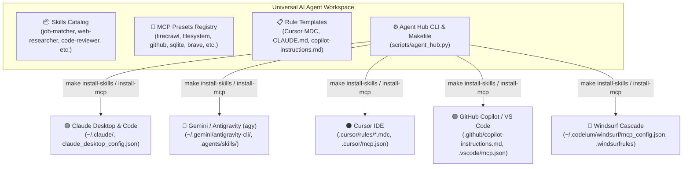

# Universal AI Agent Workspace 🤖

[](https://www.python.org/downloads/)
[](https://modelcontextprotocol.io/)
[](https://github.com/AbhiPra24/agent-workspace)
[](Makefile)
[](LICENSE)

A modular, cross-platform workspace and hub designed to easily discover, develop, test, and install **AI Agent Skills**, **Model Context Protocol (MCP) Servers**, and **Platform Instruction Rules** across **Claude (Desktop & Code)**, **Gemini / Antigravity (`agy`)**, **Cursor**, **GitHub Copilot**, and **Windsurf**.

---

## 🌟 Architecture & Features



### 1. 📦 Standardized Skills Hub
- Built on the universal `SKILL.md` format (YAML frontmatter + structured guidelines).
- **Auto-converts** into platform-native formats: Cursor `.mdc` rules, Claude `CLAUDE.md` context, Antigravity `.agents/skills`, GitHub Copilot instructions, and Windsurf rules.

### 2. 🔌 Curated MCP Server Catalog
- 11+ ready-to-deploy presets: **Firecrawl**, **Filesystem**, **GitHub**, **SQLite**, **Brave Search**, **Puppeteer**, **Fetch**, **Git**, **PostgreSQL**, **Memory**, and **Sequential Thinking**.
- 1-click installer merges MCP configs into target client settings with automatic `.bak` backups.

### 3. 🩺 Diagnostic Health Doctor
- Inspects your system for runtimes (`node`, `npx`, `python3`, `uv`, `docker`, `git`) and detects installed AI clients.

### 4. 🛠️ Developer-First CLI & Makefile
- Comprehensive commands for scaffolding, testing, exporting, and managing skills and MCP servers.

---

## ⚡ Quickstart (60 Seconds)

### 1. Clone & Setup
```bash
git clone https://github.com/AbhiPra24/agent-workspace.git
cd agent-workspace

# Run automated setup (creates virtualenv, installs deps, creates .env)
make setup
```

### 2. Run Diagnostics & List Assets
```bash
# Check runtime health and detected AI clients
make doctor

# List bundled skills and MCP server presets
make list
```

### 3. Configure Environment Variables
Edit `.env` to provide your API keys:
```ini
FIRECRAWL_API_KEY=fc-YOUR_KEY
GITHUB_PERSONAL_ACCESS_TOKEN=ghp_YOUR_TOKEN
BRAVE_API_KEY=BSA_YOUR_KEY
```

---

## 🚀 Installing Skills & MCP Servers

### Install Skills to Your AI Tool

Export all skills or a specific skill to your target AI assistant:

| Target Platform | Makefile Command | Target Config Location |
| :--- | :--- | :--- |
| **All Platforms** | `make install-skills TARGET=all` | Configures all detected platforms |
| **Cursor** | `make install-skills TARGET=cursor` | `.cursor/rules/*.mdc` |
| **Gemini / Antigravity (`agy`)** | `make install-skills TARGET=agy` | `.agents/skills/<name>/SKILL.md` |
| **Claude (Desktop & Code)** | `make install-skills TARGET=claude` | `CLAUDE.md` / workspace rules |
| **GitHub Copilot / VS Code** | `make install-skills TARGET=copilot` | `.github/copilot-instructions.md` |
| **Windsurf** | `make install-skills TARGET=windsurf` | `.windsurfrules` |

*To install a single skill: `make install-skills TARGET=cursor SKILL=code-reviewer`*

---

### Install MCP Servers into Your AI Tool

Merge MCP server configurations directly into client configuration files:

```bash
# 1. Preview changes safely (dry run)
make install-mcp TARGET=claude DRY_RUN=1

# 2. Install all MCP servers into Claude Desktop
make install-mcp TARGET=claude

# 3. Install specific MCP servers into Cursor
make install-mcp TARGET=cursor SERVERS=firecrawl,github,sqlite

# 4. Install MCP servers into VS Code / Copilot
make install-mcp TARGET=copilot SERVERS=filesystem,git,fetch
```

> [!NOTE]
> `install-mcp` automatically creates a timestamped/`.bak` copy of your existing configuration before updating, ensuring you never lose custom server definitions.

---

## 📦 Bundled Skills Catalog

| Skill Name | Description | Trigger |
| :--- | :--- | :--- |
| **`job-matcher`** | Hybrid Scrape & Cache job matcher (SQLite + BS4 + Firecrawl fallback + LLM scoring) | `/jobmatch [resume]` |
| **`web-researcher`** | Autonomous multi-source web search, fact verification, and structured synthesis | `/research [topic]` |
| **`code-reviewer`** | Senior-level code review: correctness, security, architecture, Big-O, testability | `/review [target]` |
| **`mcp-builder`** | FastMCP and TypeScript MCP server scaffolding, schemas, and packaging | `/new-mcp-server [name]` |
| **`prompt-engineer`** | Meta-prompting, few-shot generation, and persona optimization | `/prompt-opt [task]` |

---

## 🔌 Bundled MCP Presets Registry

| Preset | Type | Description | Required Env |
| :--- | :--- | :--- | :--- |
| **`firecrawl`** | Web | JavaScript-rendered web scraping & markdown extraction | `FIRECRAWL_API_KEY` |
| **`filesystem`** | System | Safe local file system reading, writing, and search | None |
| **`fetch`** | Web | High-speed HTML-to-Markdown document fetcher | None |
| **`github`** | Dev | Issues, pull requests, repository search & management | `GITHUB_PERSONAL_ACCESS_TOKEN` |
| **`git`** | Dev | Direct Git repository control, log analysis, diff inspection | None |
| **`sqlite`** | DB | Query, inspect, and analyze SQLite databases | None |
| **`brave-search`**| Web | Privacy-first web and local search API | `BRAVE_API_KEY` |
| **`puppeteer`** | Automation | Headless browser automation and screenshot capture | None |
| **`postgres`** | DB | PostgreSQL & Supabase database querying | `DATABASE_URL` |
| **`memory`** | Knowledge | Persistent knowledge-graph memory across conversations | None |
| **`sequential-thinking`** | Reasoning | Dynamic step-by-step problem-solving and deliberation | None |

---

## 🛠️ CLI & Makefile Command Reference

```text
Universal AI Agent Workspace & Manager
Unified management for Skills, MCP Servers & Platform Rules

Available Commands:
  help                 Display interactive command reference
  setup                Create virtual environment & install dependencies
  doctor               Run runtime diagnostics & detect AI clients
  list                 List all skills & MCP presets
  list-skills          List all bundled agent skills
  list-mcp             List all available MCP server presets
  install-skills       Install/export skills to target (TARGET=all|agy|claude|cursor|copilot|windsurf)
  install-mcp          Install/merge MCP servers (TARGET=all|claude|cursor|copilot|windsurf, SERVERS=all|key1,key2)
  export-rules         Export rules to Cursor, Claude, Copilot & Windsurf
  new-skill            Scaffold a new skill template (usage: make new-skill NAME=my-skill)
  new-mcp              Scaffold a new MCP server preset (usage: make new-mcp NAME=redis)
  validate             Validate all skill frontmatters & MCP configurations
  test                 Run automated test suite
  clean                Remove cache files, test artifacts, and system temp files
```

---

## 💡 Creating New Skills & MCP Servers

### Create a New Skill
```bash
make new-skill NAME=pdf-extractor
```
This generates `skills/pdf-extractor/SKILL.md` with standard YAML frontmatter and documentation.

### Create a New MCP Preset
```bash
make new-mcp NAME=redis PACKAGE=@modelcontextprotocol/server-redis
```
This registers the server into `mcp-servers/registry.json` for 1-click deployment across all AI clients.

---

## 🧪 Testing & Validation

```bash
# Run schema and unit tests
make test
```

---

## 🔒 Security & Privacy

- **Confidential Resumes & Data**: Ignored by `.gitignore` (`*.pdf`, `resume/`, `scripts/resume/`).
- **Secrets Protection**: `.env`, cache databases (`*.db`), and backup files (`*.bak`) are excluded from version control.

---

## 📄 License
This project is open-source under the [MIT License](LICENSE).
